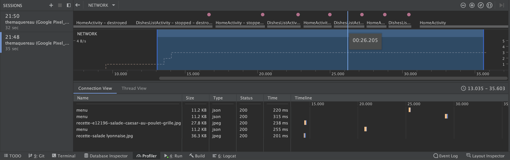
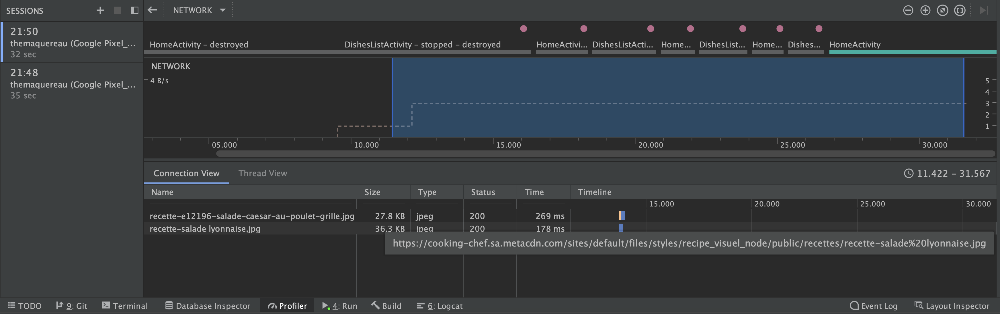
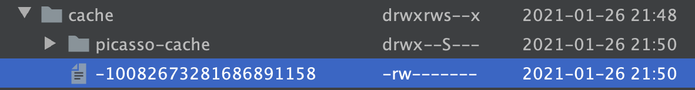
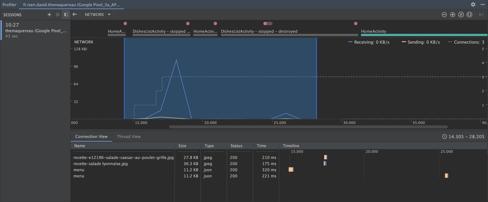

# Cache System Implementation Experimentation & Proof of Concept

The first goal of this document is to prove that the cache system is implemented in the project.
Then, this document is aim to compare the difference between a `JsonObjectRequest` without overriding
`parseNetworkResponse` and a `JsonObjectRequest` with overriding `parseNetworkResponse`

## Implementation without overriding

Kotlin code:

```kotlin
private fun loadData() {
        // Setting cache
        val cache = DiskBasedCache(cacheDir, 1024 * 1024)
        val network = BasicNetwork(HurlStack())

        // Or perform the request if no data found
        // Request a string response from the provided URL.
        val req = JsonObjectRequest(
            Method.POST, API_URL, params,
            Response.Listener<JSONObject> { response ->
                Log.d(TAG, "Response: $response")
                val dataList = gson.fromJson(response["data"].toString(), Array<Data>::class.java)
                val data = dataList[category]
                binding.categoryText.text = data.name_fr

                // items
                val rvItems = binding.itemRecyclerView
                val adapter = ItemAdapter(data.items, applicationContext)
                rvItems.adapter = adapter

                binding.itemRecyclerView.isVisible = true
            },
            Response.ErrorListener { error ->
                Log.e(TAG, "Error: ${error.message}")
        })

        // Add the request to the RequestQueue.
        val queue = RequestQueue(cache, network).apply {
            start()
        }
        queue.add(req)
    }
```

Network profiler results :



We can see on the graph 4 call of `DishesListActivity` which is the Activity 
where the `RecyclerView` is implemented and where the function `loadData` is launched in `onCreate`.

On 4 calls of the activity, we can see in light brow and blue 4 network requests each time the activity is created.
Therefore it means that the data on the 3 last call except the first one are fetching the data from the network
and not from the cache

## Fixed Implementation

Fixed Kotlin code:

```kotlin
private fun loadData() {
        // Setting cache
        val cache = DiskBasedCache(cacheDir, 1024 * 1024)
        val network = BasicNetwork(HurlStack())

        // Or perform the request if no data found
        // Request a string response from the provided URL.
        val req = object : JsonObjectRequest(
            Method.POST, API_URL, params,
            Response.Listener<JSONObject> { response ->
                Log.d(TAG, "Response: $response")
                val dataList = gson.fromJson(response["data"].toString(), Array<Data>::class.java)
                val data = dataList[category]
                binding.categoryText.text = data.name_fr

                // items
                val rvItems = binding.itemRecyclerView
                val adapter = ItemAdapter(data.items, applicationContext)
                rvItems.adapter = adapter

                binding.itemRecyclerView.isVisible = true
            },
            Response.ErrorListener { error ->
                Log.e(TAG, "Error: ${error.message}")
        }) {
            override fun parseNetworkResponse(response: NetworkResponse?): Response<JSONObject> {
                response?.let { res ->
                    try {
                        // Verify if there is some cache
                        var cacheEntry = HttpHeaderParser.parseCacheHeaders(response)
                        if (cacheEntry == null) {
                            // if not, create a cache entry
                            cacheEntry = Cache.Entry()
                        }
                        // in 3 minutes cache will be hit, but also refreshed on background
                        val cacheHitButRefreshed =
                            3 * 60 * 1000.toLong()
                        // in 24 hours this cache entry expires completely
                        val cacheExpired =
                            24 * 60 * 60 * 1000.toLong()
                        // current time
                        val now = System.currentTimeMillis()
                        // expiration time
                        val softExpire = now + cacheHitButRefreshed
                        val ttl = now + cacheExpired
                        // save raw data
                        cacheEntry.data = res.data
                        cacheEntry.softTtl = softExpire
                        cacheEntry.ttl = ttl
                        // handle cache header date
                        var headerValue: String? = res.headers["Date"]
                        if (headerValue != null) {
                            cacheEntry.serverDate = HttpHeaderParser.parseDateAsEpoch(headerValue)
                        }
                        // handle cache header Last-Modified
                        headerValue = response.headers["Last-Modified"]
                        if (headerValue != null) {
                            cacheEntry.lastModified =
                                HttpHeaderParser.parseDateAsEpoch(headerValue)
                        }
                        // Write response header
                        cacheEntry.responseHeaders = response.headers
                        val jsonString = String(
                            response.data,
                            Charset.forName("UTF-8")
                        )
                        Log.i(TAG, "from cache: $jsonString")
                        return Response.success(JSONObject(jsonString), cacheEntry)
                    } catch (e: UnsupportedEncodingException) {
                        Log.e(TAG, "Not supported encoding")
                        return Response.error(ParseError(e))
                    } catch (e: JSONException) {
                        Log.e(TAG, "Json error")
                        return Response.error(ParseError(e))
                    }
                }
                return super.parseNetworkResponse(response)
            }
        }

        // Add the request to the RequestQueue.
        val queue = RequestQueue(cache, network).apply {
            start()
        }
        queue.add(req)
    }
```

Network profiler results:



On 4 calls of the activity, we can see in light brow and blue **only one** network request on the
first call of the activity

Therefore it means that the data on the 3 last call except the first one are fetching the data from the **cache**
and not from the network.

The goal is achieved

## Note about File Explorer

In both cases, cache files has been created. Did I missed something on the first implementation



## Pull To Refresh implementation v1

Refactored Kotlin code :

```kotlin
fun loadData(): JsonObjectRequest {
    // Or perform the request if no data found
    // Request a string response from the provided URL.
    return object : JsonObjectRequest(
        Method.POST, API_URL, params,
        Response.Listener { response ->
            Log.d(TAG, "Response: $response")
            val dataList = gson.fromJson(response["data"].toString(), Array<Data>::class.java)
            val data = dataList[category]
            binding.categoryText.text = data.name_fr

            // items
            val rvItems = binding.itemRecyclerView
            val adapter = ItemAdapter(data.items, applicationContext)
            rvItems.adapter = adapter

            binding.itemRecyclerView.isVisible = true
        },
        Response.ErrorListener { error ->
            Log.e(TAG, "Error: ${error.message}")
            displayToast("Cannot Load dishes", applicationContext)
            //TODO display no dishes found + display a message if no data
    }) {
        override fun parseNetworkResponse(response: NetworkResponse?): Response<JSONObject> {
            response?.let { res ->
                try {
                    // Verify if there is some cache
                    var cacheEntry = HttpHeaderParser.parseCacheHeaders(response)
                    if (cacheEntry == null) {
                        // if not, create a cache entry
                        cacheEntry = Cache.Entry()
                    }
                    // in 3 minutes cache will be hit, but also refreshed on background
                    val cacheHitButRefreshed =
                        3 * 60 * 1000.toLong()
                    // in 24 hours this cache entry expires completely
                    val cacheExpired =
                        24 * 60 * 60 * 1000.toLong()
                    // current time
                    val now = System.currentTimeMillis()
                    // expiration time
                    val softExpire = now + cacheHitButRefreshed
                    val ttl = now + cacheExpired
                    // save raw data
                    cacheEntry.data = res.data
                    cacheEntry.softTtl = softExpire
                    cacheEntry.ttl = ttl
                    // handle cache header date
                    var headerValue: String? = res.headers["Date"]
                    if (headerValue != null) {
                        cacheEntry.serverDate = HttpHeaderParser.parseDateAsEpoch(headerValue)
                    }
                    // handle cache header Last-Modified
                    headerValue = response.headers["Last-Modified"]
                    if (headerValue != null) {
                        cacheEntry.lastModified =
                            HttpHeaderParser.parseDateAsEpoch(headerValue)
                    }
                    // Write response header
                    cacheEntry.responseHeaders = response.headers
                    val jsonString = String(
                        response.data,
                        Charset.forName("UTF-8")
                    )
                    Log.i(TAG, "from cache: $jsonString")
                    return Response.success(JSONObject(jsonString), cacheEntry)
                } catch (e: UnsupportedEncodingException) {
                    Log.e(TAG, "Not supported encoding")
                    return Response.error(ParseError(e))
                } catch (e: JSONException) {
                    Log.e(TAG, "Json error")
                    return Response.error(ParseError(e))
                }
            }
            return super.parseNetworkResponse(response)
        }
    }
}
```

The queue has been moved to the `OnCreate` function which now looks like below:

```kotlin
fun onCreate(savedInstanceState: Bundle?) {
    // ...

    // Setting cache
    val cache = DiskBasedCache(cacheDir, 1024 * 1024)
    val network = BasicNetwork(HurlStack())

    val req = loadData()

    // Add the request to the RequestQueue.
    val queue = RequestQueue(cache, network).apply {
        start()
    }
    queue.add(req)

    // Pull to Refresh Listener
    val swipeContainer = binding.swipeContainer
    swipeContainer.setOnRefreshListener {
        // invalidate the cache
        queue.cache.clear()
        items = listOf()
        // The list is not visible until the content is loaded
        binding.itemRecyclerView.isVisible = false
        // Add the request to the RequestQueue.
        queue.add(req)
        // stop the refresh
        swipeContainer.isRefreshing = false
    }
}
```

Network Profiler Results :



The user scenario was:
- Click on "Entrées" (around 15.0 s - at start of the blue pick)
- Go back to the main menu (around 19.0s - end of the blue pick)
- Click on "Entrées" again (around 21.0s)
- Pull to Refresh (around 25.0 s on the graph)

Note: the cache has been cleared before this scenario

We can see on the graph that the first time we arrive on `DishesListActivity`, data are feteched
from the server, there is a network request. Then on the second time we arrive on `DishesListActivity`,
no network request is sent because the data was fetched from the cache thanks to the previous implementation.
Finally, on pull to refresh event, there is another network request.

Note 2: we can see that the images are not fetched again. Did I cleared the cache entirely ?